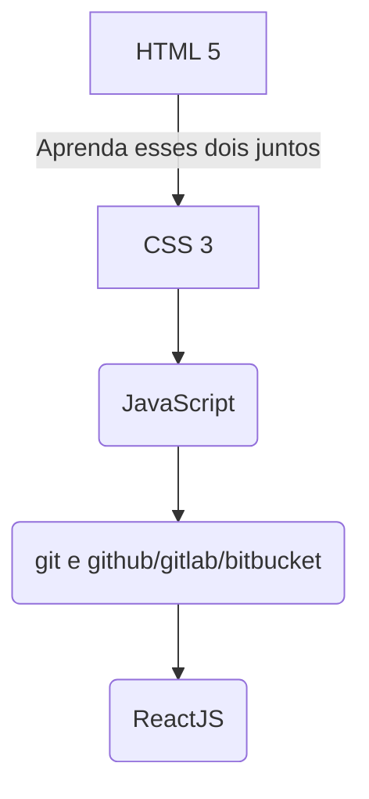
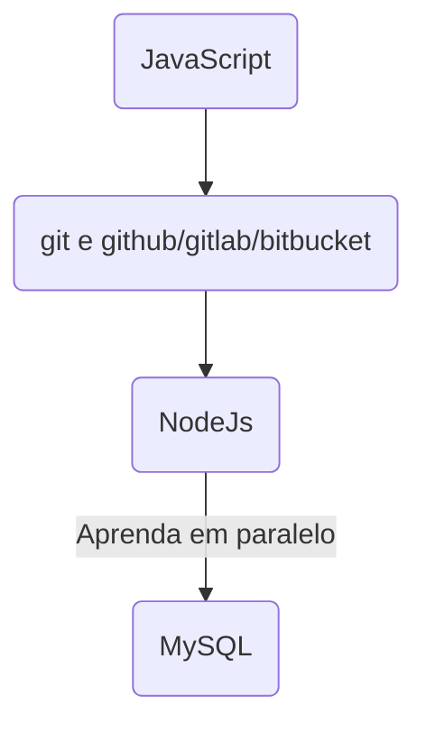
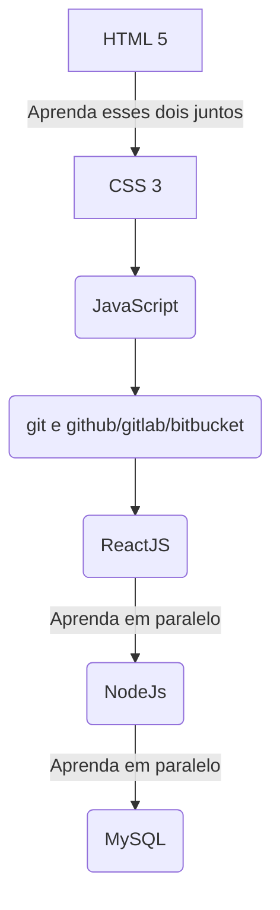

## O que aprender, qual ordem e quantos %?

---
Caso você decida ser um front-ender ou full-stack, você vai partir para o react. Caso já saiba que quer ser apenas back-ender, ignore o react e vá direto ao node.
O contrário também é verdade, caso decida ser apenas front-ender, depois ignore o nodejs e o mysql.
Esta é a representação do fluxograma de acordo com a área:
### Front-end  

### Back-end  

### Full-stack  

---

**80%** - [HTML 5](1%20-%20HTML.md) - primeiro a ser aprendido  
**60%** - [CSS 3](2%20-%20CSS.md) - aprenda junto com o HTML 5  
**80%** - [JavaScript ES6](3%20-%20JavaScript.md) - integre o javascript nas páginas com HTML e CSS, mas foque em aprender as versões mais recentes a partir do ES6.  
**30%** - [Git e Github/Gitlab/Bitbucket](4%20-%20git.md) - Crie seus primeiros repositórios num servidor remoto e comece a ter seu portfólio lá.  

## Front-end  
**70%** - [ReactJs](5%20-%20ReactJS.md)  

## Full-stack  
**70%** - [ReactJs](5%20-%20ReactJS.md)  
**70%** - [NodeJs](6%20-%20NodeJS.md)  

## Back-end  
**70%** - [NodeJs](6%20-%20NodeJS.md)  
**30%** - [MySQL](7%20-%20MySQL.md)  